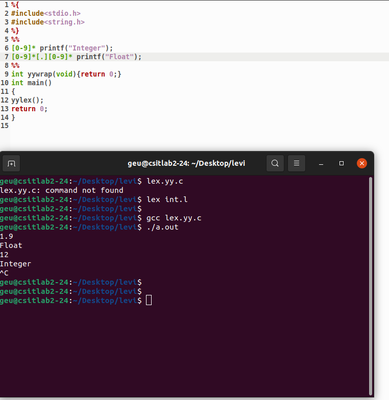

<h1>Identifying integer and float input</h1>

In this program we are going to identify wheather the given input string is an integer type or a floating type

If the input only contains digit and does not contain "." then it is an integer type else if it contains "." then it is considered as a floating type

