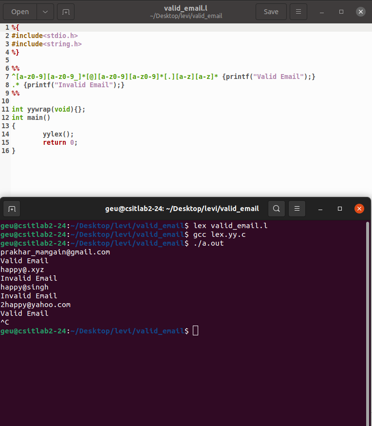

<h1>Valid Email</h1>

In this program we have to check wheather a given email is valid or not

An email is considered valid if:-

<ol type="a">
  <li>If it starts with an alphanumerical character</li>
  <li>Contains "." and "@" </li>
  <li>And has atleast one alphanumerical character before, after and between "." and "@"</li>
</ol>  

