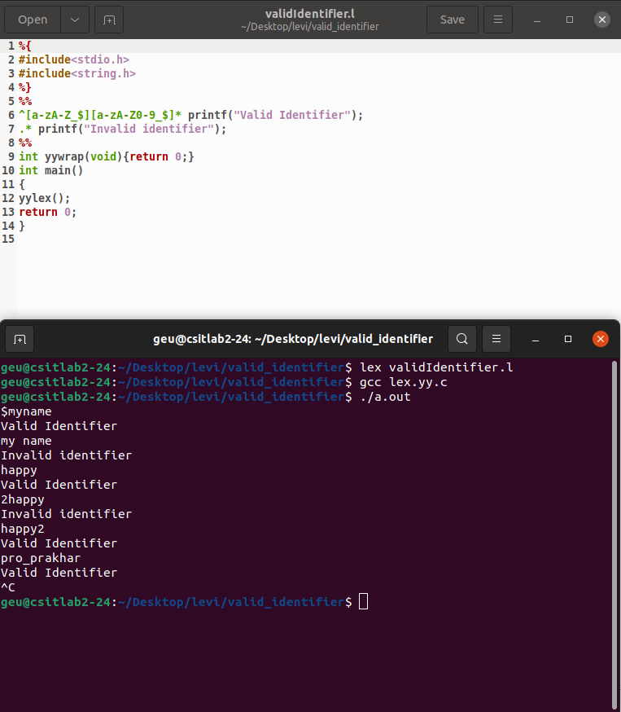

<h1>Valid Identifier</h1>

In this program we have to check wheather a given input string is a valid identifier or not

An identifier is known to be valid if

<ol type="a">
  <li>A valid identifier can have letters (both uppercase and lowercase letters), digits and special characters like("$" and "_").</li>
  <li>The first letter of an identifier should be either a letter or "$" or "_"</li>
  <li>It must not contain space </li>
</ol>

Thus we check wheather the input string starts with alphabets or special characters like "$" or "_".

Then it should be followed by alphanumericals or "$" or "_".

If the above conditions are not met then the given input is an invalid identifier.

